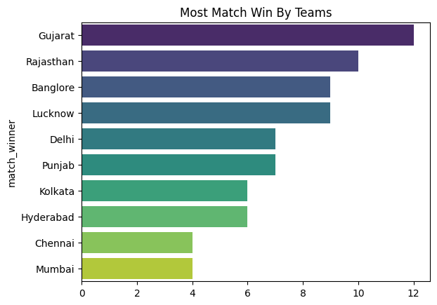
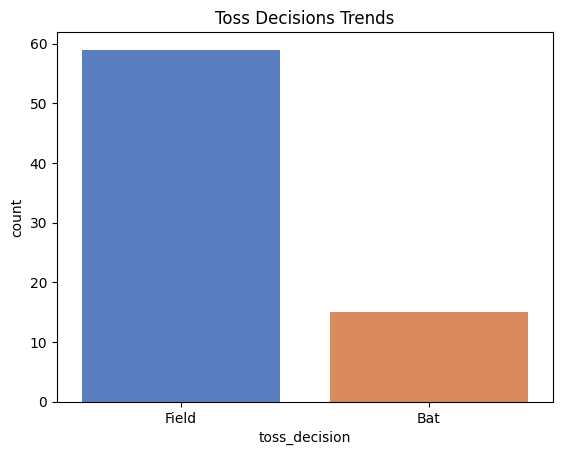
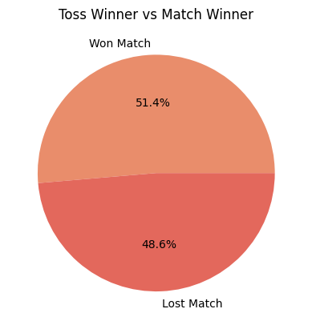
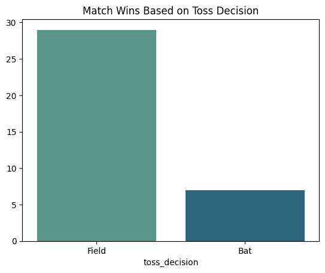
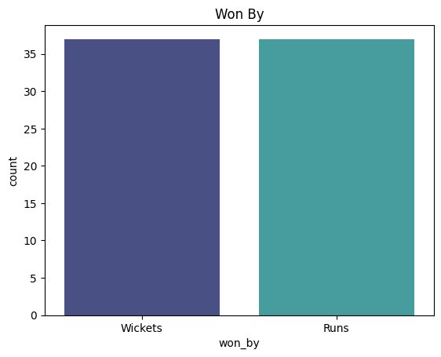
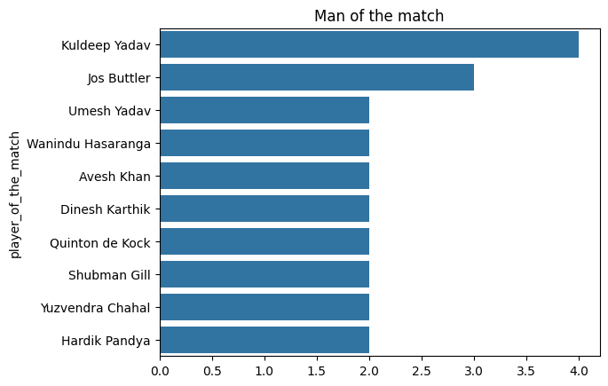
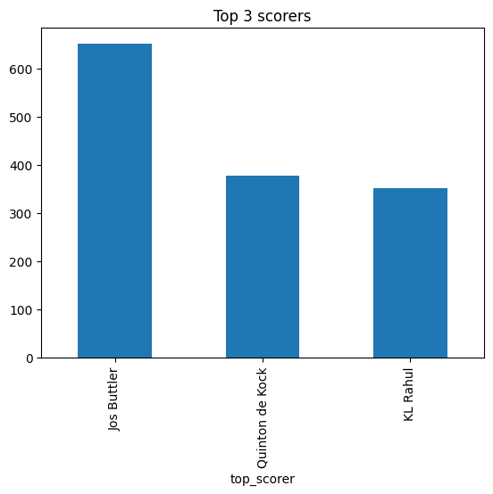
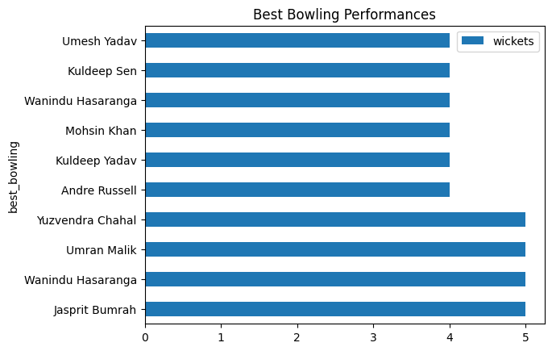
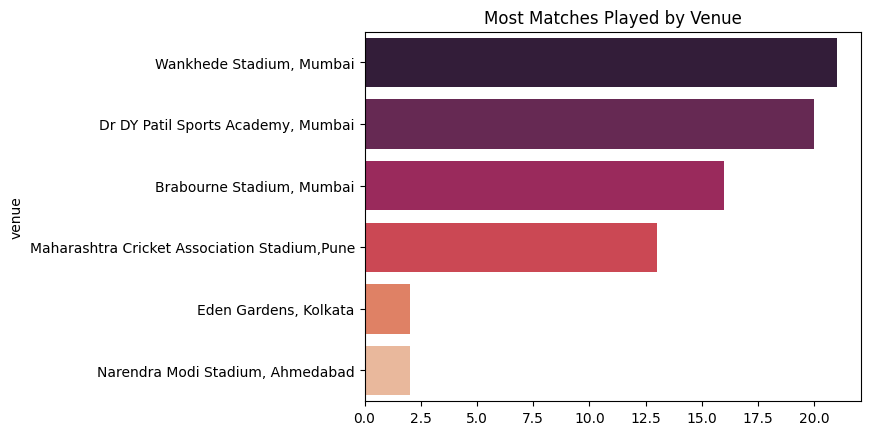

# IPL-Data-Analysis

## Overview
This project analyzes IPL match data to uncover insights about team performance, toss impact, player achievements, and match outcomes. The goal is to explore patterns in cricket data using Python and data visualization techniques.

---

## Objectives
- Identify the most successful teams  
- Analyze toss decisions and their impact on match results  
- Compare match outcomes (runs vs wickets)  
- Evaluate player performances (batting & bowling)  
- Discover key trends and patterns in IPL matches  

---

## Tools & Technologies Used
- Python  
- Pandas  
- NumPy  
- Seaborn  
- Matplotlib  

---

## Dataset
- IPL match dataset containing match-level details such as teams, scores, toss decisions, and player performances  
- Total Matches Analyzed: **74**

---

## Key Insights

- Gujarat was the most dominant team with the highest number of wins  
- Toss does not significantly impact match outcomes (~48.6%)  
- Teams choosing to field first tend to win more matches  
- Both wickets and runs have equally been won in this dataset  
- Kuldeep Yadav got the highest number of Man of the Match title in this dataset  
- Jos Buttler leads in overall scoring performance  
- Jasprit Bumrah delivered the most efficient bowling performance (5–10)  

---

## Visualizations

### Most Successful Teams

### Toss Decision Trends

### Toss Impact on Match Outcome

### Bat vs Field Decision

### Match Winning Type

### Top Players (Man of the Match)

### Top Scorers

### Best Bowling Performances

### Venue Analysis

---

## Conclusion
This analysis highlights that while toss decisions influence strategy, they do not guarantee victory. Teams that chase targets tend to perform slightly better. Individual performances, especially from players like Jos Buttler and Jasprit Bumrah, play a crucial role in match outcomes.

---

## Future Improvements
- Add interactive dashboard (Power BI)  
- Perform season-wise comparison  
- Apply machine learning to predict match outcomes  

---

## Author
**Leesha Chavda**

## Learning Source & Dataset

This project was inspired by a data visualization tutorial from Sheryians AI School.  
The dataset used in this project was provided as part of that tutorial.
